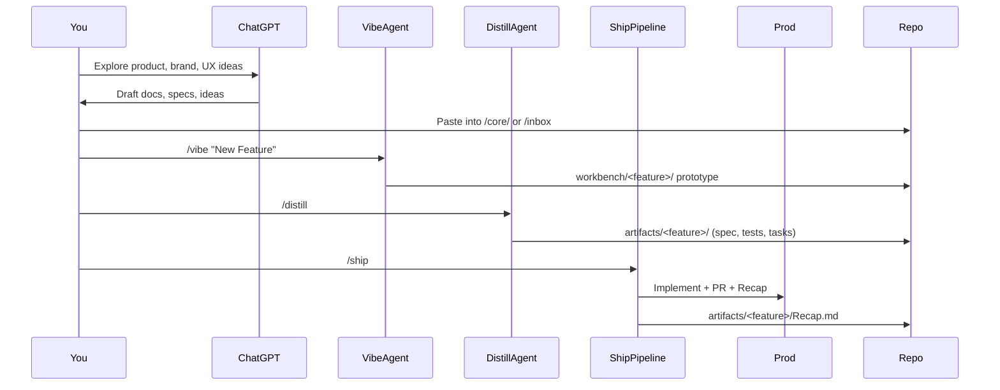

# 🚀 dual-track-AIPD

> **Dual-Track AI Product Development**  
> A starter repo for running a **ChatGPT-first, dual-track workflow**:  
> **Discovery & Planning** → **Vibe Prototyping** → **Artifact Distillation** → **Hands-off Shipping**.  

This system lets you:
- Collaborate with ChatGPT on **brand, strategy, product goals, and UX guidelines**.
- Rapidly prototype new features in a **safe workbench** (`/vibe`).
- Distill prototypes into **specs, acceptance tests, and tasks** (`/distill`).
- Ship them to production via a **hands-off pipeline** with Developer → Reviewer → PM agents (`/ship`).

---

## 📂 Repository Structure

```

dual-track-AIPD/
│
├── core/                # High-level docs (you paste here from ChatGPT)
│   ├── brand/           # Brand guidelines, visuals, voice
│   ├── strategy/        # Vision, market thesis, principles
│   ├── product/         # Goals, audiences, roadmap
│   ├── ux/              # UI/UX design system, writing rules
│   └── references/      # Links, recaps, research
│
├── inbox/               # Raw ChatGPT outputs, scratchpad
├── workbench/           # Feature sandboxes (created via /vibe)
├── artifacts/           # Distilled specs, acceptance tests, tasks
│
├── .flow/               # Prompts, rules, and workflow definitions
│   ├── commands/        # Agent prompts (/vibe, /distill, /ship)
│   └── guards.md        # PROD\_ROOTS, file caps, task caps
│
├── .cursor/             # IDE integration (slash commands)
├── tools/               # CLI helpers (forge, etc.)
└── README.md            # You are here

````

---

## 🔄 The Dual-Track Process

```mermaid
flowchart LR
    A[ChatGPT Discovery] --> B[Vibe Prototyping (/vibe)]
    B --> C[Artifact Distillation (/distill)]
    C --> D[Hands-off Shipping (/ship)]
    D --> E[Production Code + Recap]
    E -->|Feeds back| A
````

**1. Discovery & Planning (ChatGPT app)**

* Work with ChatGPT on strategy, product goals, UX rules.
* Paste curated docs into `/core/` (they become context for agents).
* Dump raw ideas into `/inbox/` if not ready yet.

**2. Vibe Prototyping**

* Run `tools/forge vibe "Feature Name"`
* Creates a sandbox in `/workbench/<feature>/`
* Use `/vibe` in your IDE → prototype UI/UX safely, with adapters pulling in production resources.

**3. Artifact Distillation**

* Run `/distill` in IDE → turns prototypes + notes into:

  * `spec.md` (lean, testable spec)
  * `acceptance-tests.md` (plain-language + stubs)
  * `tasks.md` (≤8 atomic tasks)

**4. Hands-off Shipping**

* Run `/ship` in IDE → orchestrates:

  * **Developer Agent** → implements code + tests
  * **Reviewer Agent** → enforces patterns + quality
  * **Project Manager Agent** → runs gates, finalizes PR, writes `Recap.md`

---

## ⚙️ Usage

### 📥 Bootstrap

Clone the repo and run the scaffold:

```bash
git clone git@github.com:michaelhejazi/dual-track-AIPD.git
cd dual-track-AIPD
bash bootstrap.sh
```

### 🎛️ Start a new feature

```bash
tools/forge vibe "AI Feedback Highlights"
```

This creates:

```
workbench/ai-feedback-highlights/
  ├── README.md
  ├── NOTES.md
  ├── adapters/    # Re-exports prod resources
  └── mock/        # Fake data if needed
```

### 🎨 Prototype

In your IDE (Cursor, Claude Code, Copilot, etc.):

```
/vibe   # iterate on UX/UI safely in the workbench
```

### 🧪 Distill into artifacts

```
/distill   # generates spec.md, acceptance-tests.md, tasks.md
```

### 🚀 Ship hands-off

```
/ship   # Developer → Reviewer → Project Manager pipeline
```

Delivers:

* Production code (within `PROD_ROOTS`: `app/`, `components/`, `lib/`, `styles/`)
* A PR with What/Why/Files Changed/Risks
* `artifacts/<feature>/Recap.md`

---

## 🎯 Goals of This Repo

* **Single source of truth**: brand, product, UX docs live in `/core/`, always up-to-date.
* **Safe exploration**: `/workbench/` for play + vibe coding, isolated from prod.
* **Executable artifacts**: `/artifacts/` bridge discovery and delivery.
* **Hands-off delivery**: `/ship` pipeline reduces human bottlenecks but enforces guardrails.
* **Traceability**: Each feature produces a `Recap.md` → easy to see what shipped and why.

---

## 📐 Principles

* **Dual-track**: separate discovery (explore, vibe, ideas) from delivery (implement, ship).
* **Guardrails, not gates**: let agents move fast, but enforce test coverage, file caps, and PROD\_ROOTS boundaries.
* **Human-in-the-loop optional**: you can always review artifacts before shipping, but the system works end-to-end hands-off.
* **Stack-agnostic**: works with any tech stack; production roots configurable in `.flow/guards.md`.

---

## 📊 Visual Overview of Workflow



---

## 🤝 Contributing

* Use issues to propose workflow improvements.
* PRs welcome for better prompts, guards, or tooling in `/tools/` and `/flow/`.

---

## 📌 Roadmap

* [ ] Add sample feature with spec + tasks for testing.
* [ ] GitHub Action: enforce file caps + acceptance tests in PRs.
* [ ] Optional Issue/Project sync (tasks → GitHub Issues).
* [ ] Pre-commit hooks for stricter PROD\_ROOTS enforcement.

---

## 📖 License

MIT
