# 🚀 Dual-Track AI Product Development 🚀

<div align="center">
  
  
  
</div>

<p align="center">
  A starter repository for a ChatGPT-first, dual-track workflow.
  <br />
  <strong>Discovery & Planning</strong> → <strong>Vibe Prototyping</strong> → <strong>Artifact Distillation</strong> → <strong>Hands-off Shipping</strong>.
  <br />
  <a href="#-about-the-project"><strong>Explore the docs »</strong></a>
  <br />
  <br />
  <a href="#-getting-started">View Demo</a>
  ·
  <a href="https://github.com/michaelhejazi/dual-track-AIPD/issues">Report Bug</a>
  ·
  <a href="https://github.com/michaelhejazi/dual-track-AIPD/issues">Request Feature</a>
</p>

---

## 📖 About The Project

This system empowers you to collaborate with ChatGPT on **brand, strategy, product goals, and UX guidelines**. You can rapidly prototype new features in a **safe workbench**, distill prototypes into **specs, acceptance tests, and tasks**, and ship them to production via a **hands-off pipeline** with dedicated AI agents for development, review, and project management.

### ✨ Core Ideas

*   **Single source of truth**: `.dtaipd/core/` holds brand, product, and UX docs.
*   **Safe exploration**: `workbench/` for isolated feature prototyping.
*   **Executable artifacts**: `.dtaipd/artifacts/` bridge the gap between discovery and delivery.
*   **Hands-off delivery**: A `/ship` pipeline reduces human bottlenecks.
*   **Traceability**: Each feature gets a `Recap.md` for a clear history.

---

## 🗺️ Table of Contents

*   [About The Project](#-about-the-project)
*   [Repository Structure](#-repository-structure)
*   [The Dual-Track Process](#-the-dual-track-process)
*   [Getting Started](#-getting-started)
*   [Usage](#-usage)
*   [Contributing](#-contributing)
*   [License](#-license)

---

## 📂 Repository Structure

```
dual-track-AIPD/
│
├── 📁 .dtaipd/
│   ├── 📁 core/                # 🧠 High-level docs (paste from ChatGPT)
│   │   ├── 🎨 brand/           # Brand guidelines, visuals, voice
│   │   ├── 📈 strategy/        # Vision, market thesis, principles
│   │   ├── 🎯 product/         # Goals, audiences, roadmap
│   │   ├── 🖌️ ux/              # UI/UX design system, writing rules
│   │   ├── 💻 tech-stack/      # Tech stack, architecture, and infrastructure
│   │   └── 📚 references/      # Links, recaps, research
│   │
│   ├── 📥 inbox/               # 📝 Raw ChatGPT outputs, scratchpad
│   ├── 📜 artifacts/           # ✨ Distilled specs, acceptance tests, tasks
│   │
│   └── 🤖 .flow/               # 🧠 Prompts, rules, and workflow definitions
│       ├── ➡️ commands/        # Agent prompts (/vibe, /distill, /ship)
│       └── 🛡️ guards.md        # PROD_ROOTS, file caps, task caps
│
├── 🛠️ workbench/           # Feature sandboxes (created via /vibe)
├── 🔌 .cursor/             # IDE integration (slash commands)
└── 📄 README.md            # 📍 You are here
```

---

## 🔄 The Dual-Track Process

This workflow is designed to move from idea to production in a structured, AI-assisted way.

```mermaid
flowchart LR
    A([💡 ChatGPT Discovery]) --> B([🎨 Vibe Prototyping: /vibe])
    B --> C([🧪 Artifact Distillation: /distill])
    C --> D([🚀 Hands-off Shipping: /ship])
    D --> E([📦 Production Code + Recap])
    E --> A
```



### 1. 🧠 Discovery & Planning (in ChatGPT)

*   Collaborate with ChatGPT on strategy, product goals, and UX rules.
*   Curate and paste final documents into `/.dtaipd/core/` to provide context for the agents.
*   Use `/.dtaipd/inbox/` as a scratchpad for raw ideas.

### 2. 🎨 Vibe Prototyping (in your IDE)

*   Use the `/vibe` command to quickly prototype UI/UX in a safe, isolated environment. Adapters pull in production resources without risk.

### 3. 🧪 Artifact Distillation (in your IDE)

*   Run the `/distill` command to transform prototypes and notes into concrete, executable artifacts:
    *   `spec.md`: A lean, testable specification.
    *   `acceptance-tests.md`: Plain-language tests and code stubs.
    *   `tasks.md`: A list of atomic, actionable tasks.

### 4. 🚀 Hands-off Shipping (in your IDE)

*   Execute the `/ship` command to trigger the automated pipeline:
    *   **Developer Agent**: Implements the code and tests.
    *   **Reviewer Agent**: Enforces patterns, quality, and consistency.
    *   **Project Manager Agent**: Manages gates, finalizes the PR, and writes a `Recap.md`.

---

## 🚀 Getting Started

Clone the repository to get started.

```bash
git clone https://github.com/michaelhejazi/dual-track-AIPD.git
cd dual-track-AIPD
```

---

## 🎮 Usage

The workflow is driven by a few simple commands from within your IDE. The commands have been recently refactored for clarity and consistency, with more detailed instructions for the AI agents.

| Command      | Description                                                                              | Output                                                                 |
| :----------- | :--------------------------------------------------------------------------------------- | :--------------------------------------------------------------------- |
| **/capture** | Summarizes the latest inbox note and extracts any TODOs.                                 | `.dtaipd/inbox/SUMMARY.md`                                             |
| **`/vibe`**  | Creates a prototype in the workbench based on a user's description.                        | `workbench/<feature>/`                                                 |
| **`/distill`** | Processes a feature to generate a specification, acceptance tests, and tasks.            | `.dtaipd/artifacts/<feature>/`                                         |
| **`/ship`**    | Runs the automated pipeline to develop, review, and manage the feature shipment.         | Production code, a PR, and `.dtaipd/artifacts/<feature>/Recap.md` |

### Visual Overview of the Workflow


---

## 🤝 Contributing

Contributions are what make the open source community such an amazing place to learn, inspire, and create. Any contributions you make are **greatly appreciated**.

1.  Fork the Project
2.  Create your Feature Branch (`git checkout -b feature/AmazingFeature`)
3.  Commit your Changes (`git commit -m '''Add some AmazingFeature'''`)
4.  Push to the Branch (`git push origin feature/AmazingFeature`)
5.  Open a Pull Request

---

## 📜 License

Distributed under the MIT License. See `LICENSE` file for more information.